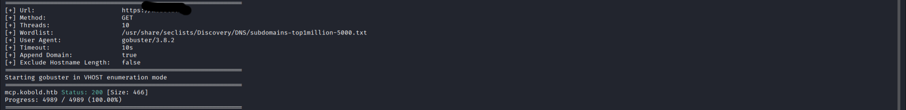
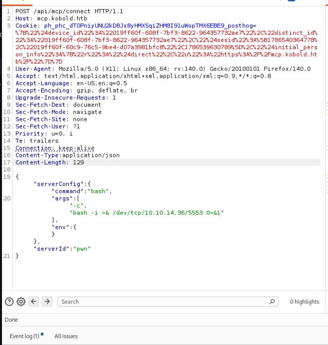

## Содержание
- [Разведка (Recon)](#разведка-recon)
- [Эксплуатация (Exploitation)](#эксплуатация-exploitation)
- [Повышение привилегий (PrivEsc)](#повышение-привилегий-privesc)
- [Тупики (DeadEnds)](#тупики-deadends)


##Разведка (Recon)

Проверим какие порты открыты на целевом устройстве

Запускаем nmap сканирование:

```bash
nmap -sC -sV Ip-цели
```


Порт 80 открыт, значит у цели есть сайт. 
Попробую перечислить конечные точки с помощью Gobuster:

```bash
gobuster dir -u  http://IP-цели -w /usr/share/wordlists/dirb/common.txt
```


Мы види код ошибки 301, который говорит нам о том, что сайт перенаправляет нас вечно на главную страницу

В таком случае будет логично попробывать перечислить поддомены:

```bash
gobuster vhost -u URL -w /usr/share/seclists/Discovery/DNS/subdomains-top1million-5000.txt --append-domain -k
```




И в итоге мы нашли кое какой поддомен

##Эксплуатация (Exploitation)]

Зайдя на сайт мы видим что он связан с MCPJam для которой я уже недавно читал статью об уязвимости. Соответственно в интернетe на неё находим CVE-2026-23744
которая говорит нам об уязвимости api/mcp/connect при отправке на неё запроса HTTP с JSON нагрузкой. Я же буду отправлять всё это через BurpSuit

Для этого включаю прокси сервер в настройках своего firefox который связан с Burp и перехватываю один из запросов с помощью Burp отправляя его в Repeater.Там же я меняю формат с GET на POST добавляя /api/mcp/connect/ и нужно задать поле "Content-type:application/json" для отправки именно в формате JSON.Делаем пробел после заголовка и формируем reverse shell.Его я взял с сайта "Online reverse shell". Далее включаю прослушку командой "nc -lvnp порт который слушаем".Повторно отправляем форму и получаем оболочку




##Повышение привилегий (PrivEsc)

далее стабилизируем оболочку командой:

```bash
python3 -c 'import pty; pty.spawn("/bin/bash")'
```
Зайдя в домашний каталог мы сразу забираем первый флаг!

##Тупики (DeadEnds)

1.На моменте перечисления поддоменов я надолго застрял так как команда "gobuster dns -d IP-цели -w /usr/share/seclists/Discovery/DNS/dns-Jhaddix.txt  --wildcard" не выдавала никаких результатов. Я думал что дело в списке и мне пришлось воспользоваться подсказкой. Оказалось что машины настроены так, что поддомены существуют только на самом сервере и не прописаны в публичном DNS, поэтому нужная команда это "gobuster vhost -u URL -w /usr/share/seclists/Discovery/DNS/subdomains-top1million-5000.txt --append-domain". Но и тут меня встретила ошибка связанная с проверкой SSL сертификата. Суть в том что Gobuster когда проверял ssl сертификат выдал ошибку так как на HTB они самоподписаные и необходимо добавить флаг "-k" который отменять проверку.

2.Когда дело дошло до формирования полезной нагрузки в Burp я не знал как её синтаксически правильно оформить, так как почти никогда не работал с таким форматом. Пришлось лезть на Хабр и искать похожие ситуации. Но так как на хабр такого не было решил воспользоваться ИИ. Я и сам не рад что пользуюсь таким но иначе никак, но хотя бы радует, что остального всего я додумался сам.


