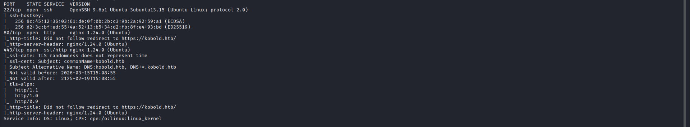
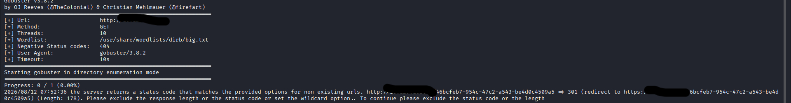

## Содержание
- [Разведка (Recon)](#разведка-recon)
- [Эксплуатация (Exploitation)](#эксплуатация-exploitation)
- [Повышение привилегий (PrivEsc)](#повышение-привилегий-privesc)
- [Тупики (DeadEnds)](#тупики-deadends)

##Разведка (Recon)

Проверим какие порты открыты на целевом устройстве

Запускаем nmap сканирование:

'''bash
nmap -sC -sV Ip-цели

Порт 80 открыт, значит у цели есть сайт. Перейдя на сайт я сразу проверил код страници комбинацией "CTRL+U" и в самом конце из полезного я нашёл там имя пользователя для SSH. Теперь нужно найти пароль

Попробую перечислить конечные точки с помощью Gobuster:

'''bash
gobuster dir -u  http://IP-цели -w /usr/share/wordlists/dirb/common.txt

Мы види код ошибки 301, который говорит нам о том, что сайт перенаправляет нас вечно на главнуюю

В таком случае будет логтчно попробывать перечислить поддомены:

'''bash
gobuster vhost -u https://kobold.htb -w /usr/share/seclists/Discovery/DNS/subdomains-top1million-5000.txt --append-domain -k

И в итоге мы нашли кое какой поддомен

##Тупики (DeadEnds)

1.На моменте перечисления поддоменов я надолго застрял так как команда "gobuster dns -d IP-цели -w /usr/share/seclists/Discovery/DNS/dns-Jhaddix.txt  --wildcard" не выдавала никаких результатов.Я думал что дело в списке и мне пришлось воспользоватья подсказкой.Оказалось что машины настроены так, что поддомены существуют только на самом сервере и не проприсаны в публичом DNS, поэтому нужноя команда это "gobuster vhost -u URL -w /usr/share/seclists/Discovery/DNS/subdomains-top1million-5000.txt --append-domain". Но и тут меня встретила ошибка связанная с проверкой SSL сертификата. Суть в том что Gobuster когда проверял ssl сертификат выдал ошибку так как на HTB они самоподписаные и необходимо добвать флаг "-k" который отменять проверку.

