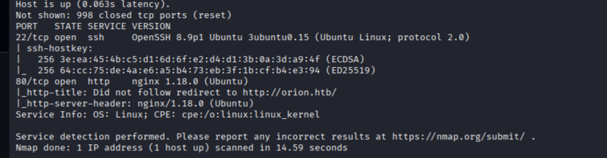

## Содержание
- [Разведка (Recon)](#разведка-recon)
- [Эксплуатация (Exploitation)](#эксплуатация-exploitation)
- [Повышение привилегий (PrivEsc)](#повышение-привилегий-privesc)
- [Тупики (DeadEnds)](#тупики-deadends)

##Разведка (Recon)

Запускаем nmap сканирование:

'''bash
nmap -sC -sV Ip-цели

