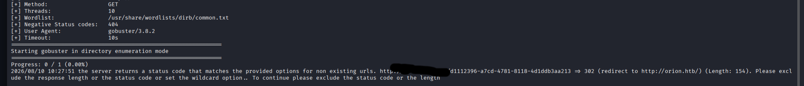

## Содержание
- [Разведка (Recon)](#разведка-recon)
- [Эксплуатация (Exploitation)](#эксплуатация-exploitation)
- [Повышение привилегий (PrivEsc)](#повышение-привилегий-privesc)
- [Тупики (DeadEnds)](#тупики-deadends)

##Разведка (Recon)

Запускаем nmap сканирование:

'''bash
nmap -sC -sV Ip-цели

Мы видим открытый 80 порт, значит можно сразу запустить gobuster, что бы он перечислил конечные точки:

Запуск сканера Gobuster:

'''bash
gobuster dir -u  http://IP-цели -w /usr/share/wordlists/dirb/common.txt

Мы видим код ошиибки 302,говорящий нам о существовании папки /admin.При переходе в неё на сайте нас автоматически перекидывает в папку /login, где есть так же указана версия CraftCMS:

##Эксплуатация (Exploitation)

##Повышение привилегий (PrivEsc)

##Тупики (DeadEnds)

1.После перехода на сайт цели я запустил gobuster и он мне выдал ошибку 302.Я конечно сразу не понял почему он не перечислил конечные точки,но забив информацию в интернети про этот код ошибки я понял,что это говорит нам о существовании папки /admin
