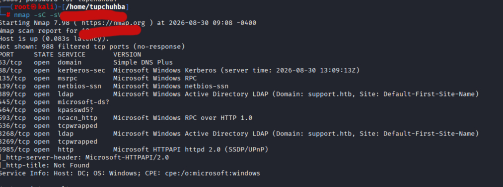
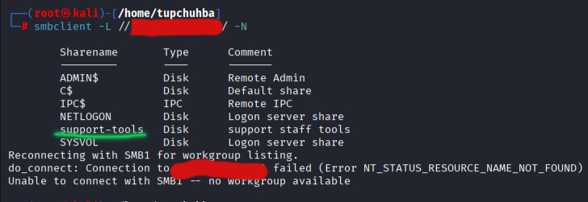
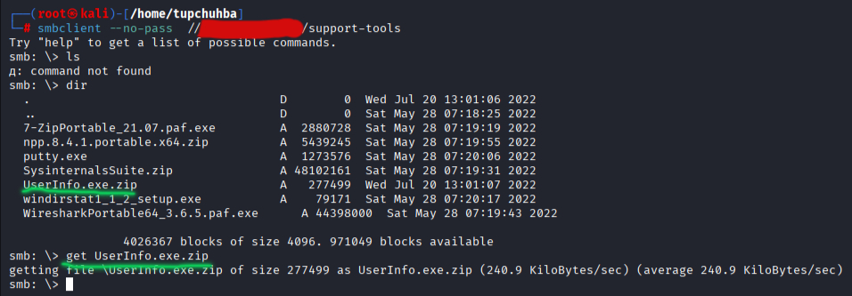

## Содержание
- [Разведка (Recon)](#разведка-recon)
- [Эксплуатация (Exploitation)](#эксплуатация-exploitation)
- [Повышение привилегий (PrivEsc)](#повышение-привилегий-privesc)
- [Тупики (DeadEnds)](#тупики-deadends)

##Разведка (Recon)

Проводим nmap сканирование:

```bash
nmap -sV -sC IP-цели
```



Мы видим много открытых портов, а также порты 139 и 445 которые связаны с SMB протоколом. Nmap также вытащил домен "support.htb". По порту 389 и 3268 понятно что машина будет основана на атаке на Active Directory. И так как это моя первая машина на AD я, по большей части, буду решать её используя подсказки и разбираться во всём происходящем.

На самом сайте HTB есть первоя задача которая просит перечислить количество соединений на SMB порту.
Для этого я использую smbclient c которым я уже работал и знаю как пользоваться:

```bash
 smbclient -L //IP-цели/ -N
```

Сам по себе smbclient даёт возможность подключаться к удалённым пк и просматривать списки папок. Флаг -N или --no-pass позволяет игнорить запрос пароля.



Из всех нестондартных Sharname - это явно "support-tools".

И так как SMB позволяет нам подключаться удалённо, то мы так и сделаем:

```bash
smbclient --no-pass  //IP-цели/support-tools
```
В итоге мы подключились удалённо и можем попробовать что то достать. командой dir мы развернём все доступные файлы:




