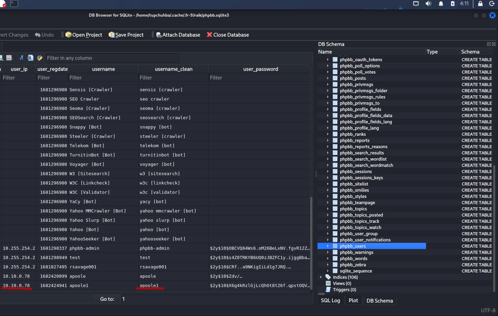
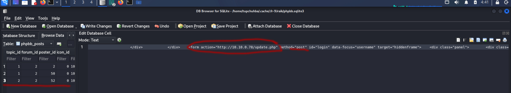
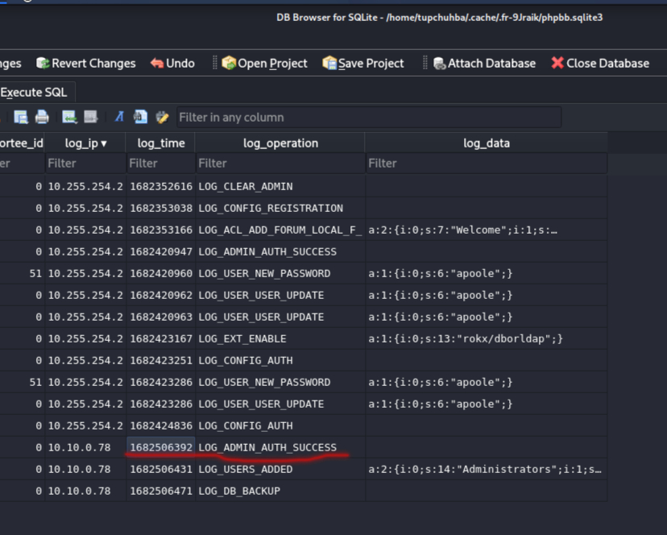
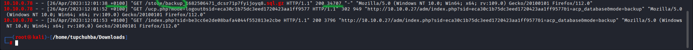

## Описание инцидента

В компании Forela произошла утечка данных на форуме. Злоумышленник, подключившись через гостевой WI-FI, получил доступ к форуму и украл учётные данные администратора. Для расследования нам дали два артефакта: логи веб-сервера и дамп базы данных форума в формате sqlite3.

## Ход расследования

## Шаг 1:Анализ файлов

Сперва у нас просят найти имя этого злоумышленника. Для этого лучше всего зайти в базу данных и в таблице users поискать его




Тут видно, что из всех пользователей не во внутренней подсети находиться пользователь "apoole1", так как его IP не относиться к подсети 10.255.255.0/24

Далее нас просят узнать на какой URI злоумышленник отправлял данные. Для этого логично будет зайти в таблицу "posts"



Тут мы видим огромную отправленную HTML форму, в которой мы находим тот самый URI

## Шаг 2:Поиск следов атаки и установление хронологии

Время в которое злоумышленник впервые зашёл от имени админа:



ну и соотвественно конверуия вреиени Unix в наше:

```bash
date -d @1682506392 -u
```
И получаем нужное время:


Также видно на фото время во сколько злоумышленник добавил себя в админы (время переводим той же командой:date -d @времяUnix -u)

Далее нам нужно найти время когда злоумышленник скачал бэкап БД. И так как вариант из базы данных не подходим, значит ищем в access.log:

```bash
 grep -E "10.10.0.78|sql"<access.log
```



Главно не забыть от данного времени отнять час, так как там указано "+0100"

размер в байтах бэкапа так же на картине

## Машина пройдена!


## Тупики

1.Когда надо было найти время первого вхождения злоумышленника от имени админа, я не знал где его найти. Сначало я долго искал в access.log, применяо фильтры по типу (grep -E "adm|admin") но ниодно время не подходило. В бвзе данных в колонке "php_log" был момент где злоумышленник зашёл как админ, но там был набор цифр в столбце "log_time", а так как я ниразу не работал с sqlite3 я не знал что время там нужно преобразовывать в наше. Об этом я кончно же узнал в интернете когда искал ответ.


