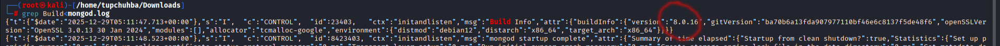
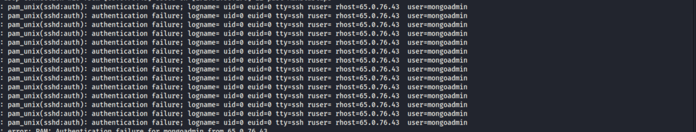
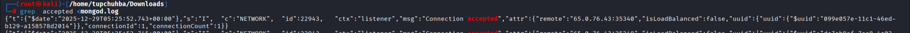
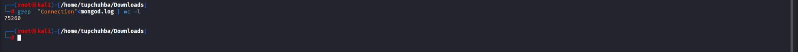
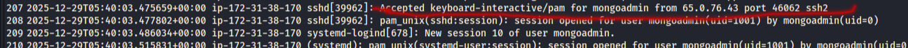

## Описание инцидента

Поступила задача провести расследование компрометации вторичного MongoDB-сервера.
Админ сервера предоставил нам root-доступ для изучения,а также передал дамп артефактов,собранных с помощью UAC.

## Ход расследования

## Шаг 1:Анализ файлов

Нам дан дамп с кучей файлов. Логичнее всего будет зайти сперва в папку [root->var->log] так как там всегда назодятся все логи. Там же мы находим папку с названием базы данных и соответсвенно вытягиваем оттуда логи нашей базы данных. Я их скачал в свою папку так как без фильтрации нужной инфы не найти.

Далее используя команду:

```bash
grep Build<"название файла с логами"
```
Таким образом я хочу найти версию БД,что бы понять какой CVE использует злоумышленник.



Отсюда следует, что версия БД:8.0.16
В интернете ищем на неё CVE а именно CVE-2025-14847

## Шаг 2:Поиск следов атаки и установление хронологии

Далее у нас просят найти ip злоумышленника. В логах mongodb его нет, поэтому я решил зайти в файл auth.log. Там же я увидел сразу интересную картину:



Здесь видно, что некий IP-адрес многократно пытался войти в систему от имени админа, но пока безуспешно. Это и есть ip злоумышленника

Первоя атака началась в тот момент когда злоумышленник подключился к серверу. Для этого в логе "mongod.log" найдём инфу про первое успешное подключение

Команда:

```bash
grep accepted<"лога mongodb"
```
И самое первое подключение и будет началом эксплуатации.



Также устонавливал в сумме 75260 соединений
Это можно проверить командой:

```bash
grep  "Connection"<"лога mongodb" | wc -l
```



Ещё нас просят назвать точное время когда злоумышленник получил удалённый доступ к системе. Это можно найти в логах auth.log после всех неудачных попыток подключения от имени админа



Далее нам нужно найти команду которую злоумышленник применил для повышении привелегий. Так как он зашёл в систему от имени админа "mongoadmin", нам нужно будет перейти в домашний каталог и найти историю команд [home->mongoadmin->.bash_history] там мы и найдём нужную команду

И там же мы найдём путь к каталогу которого интересовал злоумышленник


## В итоге машина пройдена!


